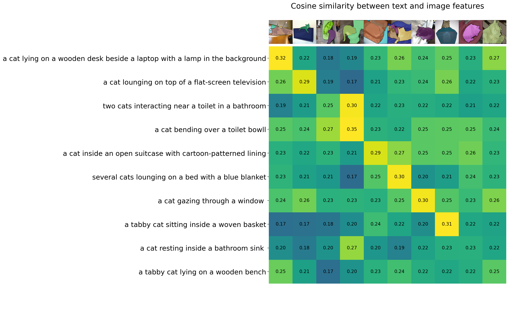

# 🌟 Ranran Hu's Project Portfolio

🎓 **Computer Science Master's Student @ UMass Dartmouth**  
💡 Focused on **Data Visualization**, **AI Applications**, and **Interactive Web Dashboards**  
📍 Based in Hartford, CT | Languages: 🇨🇳 🇺🇸 🇫🇷

---

## 🔍 Featured Projects

---

### 🏠 [CT Real Estate Dashboard](https://github.com/RanranHu168/ct-real-estate-dashboard-DV-Long-Term-Project)
An interactive dashboard visualizing real estate trends in Connecticut (2000–2024), with map filtering, property analysis, and investment indicators.

**Tech Stack**: D3.js, JavaScript, Leaflet, CSV  
📸 

---

### 📧 [Email Network Visualization](https://github.com/RanranHu168/email-network-d3-visualization)
A D3 force-directed graph showing email interactions and clusters. Features include zoom/pan, tooltips, node degree-based sizing, and k-means cluster colors.

**Tech Stack**: D3.js, JavaScript, JSON  
📸 

---

### 🌲 [ECharts Tree & Treemap Visualization](https://github.com/RanranHu168/echarts-tree-and-treemap-visualization)
Hierarchical data displayed using ECharts Tree and Treemap layouts, highlighting part-whole and parent-child relationships.

**Tech Stack**: ECharts, JavaScript  
📸   
📸 

---

### 📈 [Multi-line Chart for Supply Chain](https://github.com/RanranHu168/multi-line-d3js-assignment2)
Visualizes trends of supply chain costs, revenue, and profit margin over time using a clean D3.js multi-line chart.

**Tech Stack**: D3.js, HTML/CSS, JavaScript  
📸 

---

### 📊 [Seaborn + Altair Population Analysis](https://github.com/RanranHu168/seaborn-altair-viz-assignment1)
Data exploration and visualization using Python libraries. Includes heatmaps, line charts, and comparative visualizations across states and age groups.

**Tech Stack**: Python, Seaborn, Altair, Matplotlib  
📸   
📸   
📸   
📸   
📸   
📸 

---

## 🤖 AI Applications

---

### 📬 [Auto-GPT Email Agent](https://github.com/RanranHu168/auto-gpt-email-agent)
An experiment using Auto-GPT to process emails, summarize content, and generate context-aware replies.

**Tech Stack**: Python, Auto-GPT, OpenAI API  
📸 
📸   

---

### 🐱 [CLIP Cat Image Understanding](https://github.com/RanranHu168/Interacting_with_CLIP_ipynb_AI_Cat_Image_Understanding)
Multimodal experiment using OpenAI CLIP to evaluate image-text similarity and classification for cat images.

**Tech Stack**: Python, CLIP, Jupyter, Torch  
📸   
📸 

---

## 🧰 Skills

**Languages**: Python, Java, JavaScript, HTML/CSS  
**Frameworks**: D3.js, ECharts, Seaborn, Altair, OpenAI API, Auto-GPT  
**Tools**: Git, GitHub, Jupyter, VS Code, Notion, ChatGPT

---

## 📫 Contact

- 📧 Email: huranran8@gmail.com
- 💼 LinkedIn: [https://www.linkedin.com/in/ranran-hu-303154152/?locale=en_US](https://www.linkedin.com/in/ranran-hu-303154152/?locale=en_US)

---

